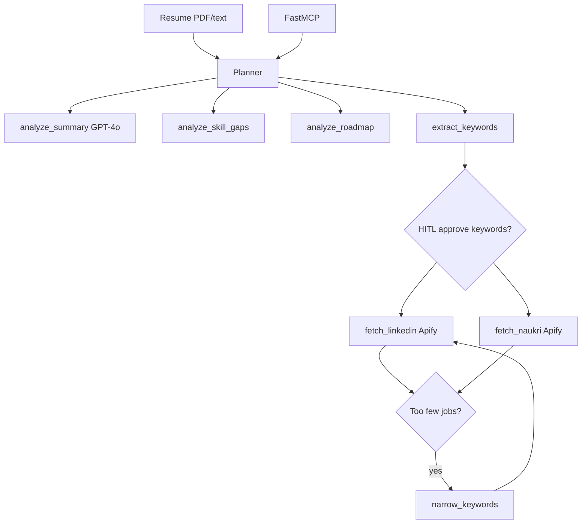

# Real-time Job Recommendation System (MCP)

### GPT-4o resume agent with LinkedIn/Naukri job tools via Apify and FastMCP

[](https://github.com/ArchanaChetan07/Real-time-Job-recommendation-system---MCP/actions/workflows/ci.yml)
[](https://www.python.org/)
[](tests/)
[](mcp_server.py)

Streamlit app and MCP server that ingests a resume (PDF/text), runs a **plan → analyze → (HITL) → fetch jobs → revise keywords** loop, and returns LinkedIn + Naukri listings. Uses **OpenAI GPT-4o** for summarization/skill-gap/roadmap analysis and **Apify** actors for live job search — with offline pytest mocks when keys are absent.

---

## Key Results

| Metric | Value | Source |
|---|---|---|
| Agent tools | **7** (summary, gaps, roadmap, keywords, narrow, LinkedIn, Naukri) | `src/agent/tools.py` |
| MCP tools | **3** (`fetchlinkedin`, `fetchnaukri`, `run_job_agent`) | `mcp_server.py` |
| Python modules | **19** under `src/` | git tree |
| Unit tests | **16** | `tests/` |
| Resume parsing | PyMuPDF | `requirements.txt` |
| Job sources | Apify LinkedIn + Naukri actors | `src/job_api.py` |
| UI | Streamlit (`app.py`) | repo root |

---

## Architecture



**How it works:** the agent extracts searchable keywords from the resume, optionally waits for user approval, queries Apify-backed job APIs, and revises keywords when results are thin. MCP exposes the full loop plus standalone fetch tools for Cursor/Claude Desktop integrations.

---

## Tech Stack

| Layer | Choice |
|---|---|
| LLM | OpenAI GPT-4o (`openai` SDK) |
| Job data | `apify-client` actors |
| MCP | FastMCP stdio server |
| UI | Streamlit |
| PDF | PyMuPDF |
| Tests | pytest |
| Packaging | Dockerfile |

---

## Features

- Structured trace of planner decisions (`src/tracing.py`)
- HITL keyword approval in Streamlit (`src/agent/hitl.py`)
- Comma-separated keyword revision when job counts are low
- Docker packaging for deployment
- `.env.example` for `OPENAI_API_KEY`, `APIFY_API_TOKEN`

---

## Installation & Usage

```bash
git clone https://github.com/ArchanaChetan07/Real-time-Job-recommendation-system---MCP.git
cd Real-time-Job-recommendation-system---MCP
pip install -r requirements.txt
cp .env.example .env
```

```bash
# Offline tests (mocked OpenAI + Apify)
pytest -q

# Streamlit UI
streamlit run app.py

# MCP server
python mcp_server.py
```

---

## Project Structure

```text
Real-time-Job-recommendation-system---MCP/
├── src/agent/       # loop, planner, tools, HITL
├── src/job_api.py   # Apify LinkedIn/Naukri fetchers
├── mcp_server.py    # 3 MCP tools
├── app.py           # Streamlit UI
├── tests/           # 16 pytest tests
└── Dockerfile
```

---

## License

See repository license file if present.
