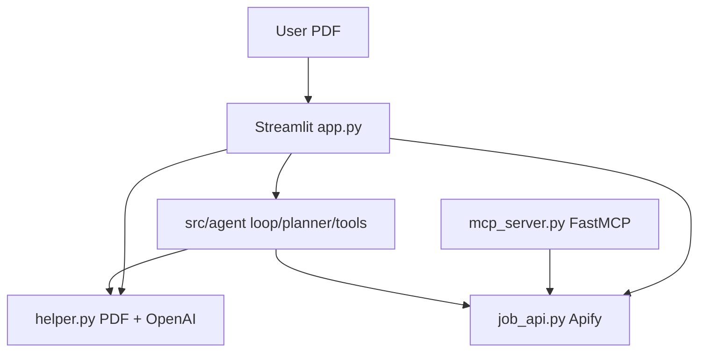
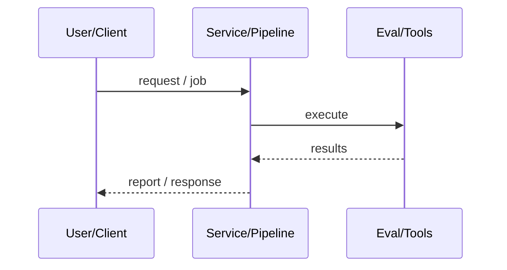
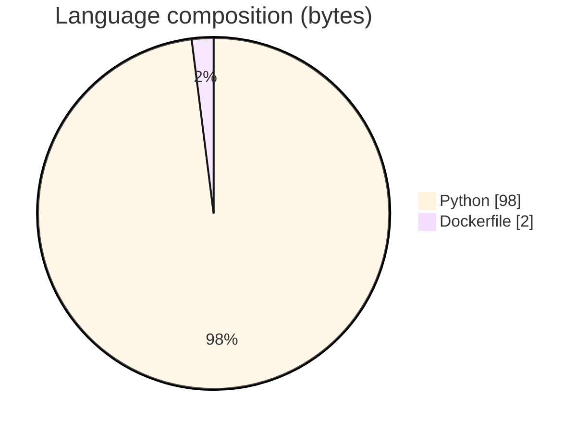

# AI Job Recommender with MCP Tools

### Streamlit resume coach that plans via an agent loop and fetches jobs through MCP/Apify.

[](https://github.com/ArchanaChetan07/Real-time-Job-recommendation-system---MCP)
[](https://github.com/ArchanaChetan07/Real-time-Job-recommendation-system---MCP)
[](https://github.com/ArchanaChetan07/Real-time-Job-recommendation-system---MCP)
[](https://github.com/ArchanaChetan07/Real-time-Job-recommendation-system---MCP/actions)

---

## Overview

Job seekers need resume understanding, skill-gap guidance, and live LinkedIn/Naukri listings without rebuilding scrapers for every AI tool.

Streamlit UI extracts PDF text (PyMuPDF), calls OpenAI for summary/gaps/roadmap, and uses Apify actors for jobs; FastMCP server exposes fetchlinkedin/fetchnaukri; src/agent implements planner/loop/HITL/tools with retries/timeouts and demo mode.

Documented architecture with production-minded config, tests, Docker, and MCP reuse for IDEs/agents.

This repository is maintained as **production-minded portfolio work**: clear architecture, automated checks where present, and metrics that are **traceable to committed artifacts** (never invented).

---

## Architecture

Streamlit uploads PDF → helper extracts text → OpenAI analyzes resume → optional keywording → job_api/Apify (also via MCP) → escaped render; agent loop plans tool use with HITL/demo guards.





---

## Results & repository facts

> Only values found in code, configs, tests, or generated reports are listed. Absence of a clinical/ML accuracy number means it was **not** published in-repo.

| Metric | Value | Source |
|---|---|---|
| Tracked repository files | **30** | `git tree` |
| Python modules | **19** | `git tree *.py` |
| Default OPENAI_MODEL | **gpt-4o** | `src/config.py` |
| Default MAX_AGENT_STEPS | **8** | `src/config.py` |
| Default MAX_PDF_SIZE_MB | **10** | `src/config.py` |
| Default MAX_RESUME_CHARS | **50000** | `src/config.py` |
| Default DEFAULT_JOB_ROWS | **60** | `src/config.py` |
| OPENAI_TIMEOUT_SEC default | **60** | `src/config.py` |
| APIFY_TIMEOUT_SEC default | **120** | `src/config.py` |
| Tracked files | **30** | `git tree` |
| Python modules | **19** | `git tree` |
| Test-related paths | **6** | `git tree` |
| CI workflows | **Yes** | `.github/workflows` |
| Docker present | **Yes** | `repo root` |



---

## Key features

- Resume PDF upload with size/type validation
- LLM summary, skill gaps, learning roadmap
- LinkedIn + Naukri job fetch via Apify
- MCP server tools for external agents
- DEMO_MODE when keys missing
- HITL flag and bounded agent steps
- XSS-safe HTML escaping of LLM output

---

## Tech stack

| Layer | Technology |
|---|---|
| ui | Streamlit |
| llm | OpenAI |
| mcp | FastMCP |
| jobs | Apify (LinkedIn/Naukri actors) |
| pdf | PyMuPDF |
| containers | Docker |
| ci | GitHub Actions |

---

## Skills demonstrated

Python · S · t · r · e · a · m · CI/CD · testing · automation

Keyword surface: **Python · Python · machine-learning · CI/CD · testing · API · Docker · automation · data-science · software-engineering · system-design · observability · LLM · cloud**

---

## Project structure

```text
Real-time-Job-recommendation-system---MCP/
├── app.py / mcp_server.py
├── docs/ARCHITECTURE.md
├── src/{config,helper,job_api,tracing}.py
├── src/agent/{loop,planner,tools,hitl,types}.py
├── tests/
├── Dockerfile / requirements.txt / pyproject.toml / uv.lock
└── .env.example
```

---

## Installation & usage

```bash
git clone https://github.com/ArchanaChetan07/Real-time-Job-recommendation-system---MCP.git
cd Real-time-Job-recommendation-system---MCP
pip install -r requirements.txt
cp .env.example .env  # set OPENAI_API_KEY + APIFY_API_TOKEN or DEMO_MODE=1
streamlit run app.py
python mcp_server.py
```

---

## How it works

Config loads env keys and enables DEMO_MODE if missing. The UI extracts resume text, calls OpenAI with retries, and optionally fetches jobs. MCP exposes the same fetch tools for Cursor/other clients. Architecture.md details data flow and safety choices (no persistence, HTML escape).

---

## Future improvements

- Add measured latency/cost dashboards
- Expand HITL UX beyond flags

---

## License

See repository.

---

<p align="center">
  <b>AI Job Recommender with MCP Tools</b><br/>
  <a href="https://github.com/ArchanaChetan07/Real-time-Job-recommendation-system---MCP">github.com/ArchanaChetan07/Real-time-Job-recommendation-system---MCP</a>
</p>
